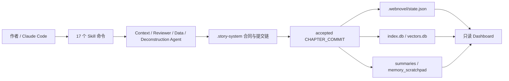

# Webnovel Writer

[](LICENSE)
[](.claude-plugin/marketplace.json)
[](https://www.python.org/)
[](https://claude.ai/claude-code)
[](.claude-plugin/marketplace.json)

<a href="https://trendshift.io/repositories/22487" target="_blank"></a>

一个跑在 Claude Code 上的长篇网文创作插件。从初始化设定、规划卷纲，到写章、审查、沉淀记忆、查询状态，再到一个只读的可视化面板——整条创作流程都给你串好了。

它想解决的其实就一件事：**让 AI 写到几百章，依然记得住设定、接得住伏笔、守得住大纲。**

一句话定位：这是一套面向长篇连载的一致性系统，不是写完就忘的一次性生成器。

> **版本导览（2026-08-19 更新）**
>
> | 分支 | 版本 | 状态 |
> |---|---|---|
> | `master`（本分支） | v6 · Claude Code 插件 | 维护中（只修致命 bug），Claude Code 用户请用此版本 |
> | `v7` | v7 · CLI 多宿主重写 | 已冻结，未发布，仅作开发档案 |
> | `v8` | v8 · 基于 [DeepSeek Harness](https://github.com/deepseek-ai/deepseek-harness) 的写作工作台 | 开发中，下一代主线 |
>
> 原 v7 设计公示（[Discussions #118](https://github.com/lingfengQAQ/webnovel-writer/discussions/118)）所征集的反馈仍是 v8 设计的重要输入；v7 的 CLI 形态经评估后不再发布，下一代改以 dsh 插件形态开发，设计文档随 v8 分支公开。

## 赞助与支持

<a href="https://www.infistar.cc/register?aff=YBE8GGRE&ref_source=link" target="_blank"></a>

**Webnovel Writer × Infistar.cc 无限星河｜全模型 API · 助力长篇网文持续创作**

感谢 [Infistar.cc 无限星河](https://www.infistar.cc/register?aff=YBE8GGRE&ref_source=link) 赞助并为 Webnovel Writer 提供模型服务支持！

- ⚡ **稳定支持长篇连续写作**：提供高可用模型通道与稳定响应，满足大纲规划、章节创作、内容审查、润色改写及长上下文写作等场景。
- 🧠 **兼容 Claude Code 与主流模型**：支持 Claude、ChatGPT、Gemini、Kimi、GLM、DeepSeek 等模型，可灵活配置长篇写作、审查和辅助模型。
- 📚 **助力记忆与知识库检索**：支持 Embedding、Rerank 等兼容 OpenAI 格式的接口，帮助角色设定、时间线、伏笔和章节内容持续沉淀，减少长篇创作中的遗忘与前后矛盾。
- 🎁 **Webnovel Writer 用户专属福利**：通过 [专属推广链接](https://www.infistar.cc/register?aff=YBE8GGRE&ref_source=link) 注册并完成首次调用，即可领取 [5美元等值测试额度 / 首充专属优惠]，快速体验更稳定、更连贯的 AI 长篇创作流程！

Webnovel Writer 用业余时间维护。如果它帮你省下了梳理设定、对齐伏笔的功夫，欢迎来信交流想法、反馈使用体验，或表达对项目的支持：

📮 **ksdflisjdf@gmail.com**

## 为什么需要它

长篇创作最难的不是写出第一章，而是写到第 80 章、第 200 章以后仍然保持：

- 角色动机不漂移
- 战力、时间线、地点和世界规则不互相打架
- 伏笔有登记、有推进、有回收
- 爽点、感情线、世界观扩展保持节奏
- 每章写完后事实会沉淀到可检索的状态系统

这套系统做的事，就是把上面这些“必须记住、不能写崩”的约束，变成 Claude Code 会自动执行的步骤：动笔前先查资料，写完后把新发生的事实记下来、做一致性审查，再把最新状态同步进检索索引、章节摘要、长期记忆和 Dashboard。它不只是“会写”，而是边写边攒。

## 核心能力

| 能力 | 命令 | 说明 |
|------|------|------|
| 深度初始化 | `/webnovel-init` | 分阶段问答，帮你把书的骨架、设定集、总纲和初始状态搭起来 |
| 总纲修改 | `/webnovel-outline-revise` | 以已发布章节为冻结线，确认式修改总纲；推翻已发布事实的诉求只阻断提示 |
| 卷纲规划 | `/webnovel-plan` | 先与你逐轮讨论卷级决策并落盘决策卡，通过闸门后再生成卷级节拍表、时间线和纯卷纲，并写回新增设定 |
| 卷纲修改 | `/webnovel-volume-revise` | 先分析并确认影响，再定向修改卷纲、备份并刷新 revision；确认轮可随时选择不再讨论 |
| 卷纲重载 | `/webnovel-volume-reload` | 人工编辑卷纲后重算 revision，并标记依赖章节为 stale |
| 章纲规划 | `/webnovel-chapter-plan` | 按批次先讨论章级决策，再生成独立章纲，校验承接并刷新章级 Story System 合同 |
| 章纲修改 | `/webnovel-chapter-revise` | 先分析并确认影响，再定向修改章纲、备份并刷新章级合同与 revision |
| 章节创作 | `/webnovel-write` | 一条龙写完一章：备上下文、起草、审查、润色、记录事实、自动备份 |
| 正文重载 | `/webnovel-chapter-reload` | 人工修改正文后按内容 revision 备份、重新校验 artifacts，并在确认后提交 |
| 抛弃正文 | `/webnovel-chapter-discard` | 抛弃一章正文：未提交草稿归档后删除，已提交章原地回退到上一章版本点（不新建分支） |
| 事实审查 | `/webnovel-review` | 章节事实一致性与逻辑审查：设定、时间线、叙事连贯、角色一致性与逻辑五维 |
| 状态查询 | `/webnovel-query` | 查询角色、伏笔、节奏、实体关系和运行时信息 |
| 项目学习 | `/webnovel-learn` | 把这本书里好用的写法记下来，存进项目长期记忆 |
| 文风学习 | `/webnovel-style-learn` | 从正文学现状、从 `文风/` 学目标，产出可复用的文风档案 |
| 可视化面板 | `/webnovel-dashboard` | 只读浏览项目状态、实体图谱、章节内容和追读力数据 |
| 项目体检 | `/webnovel-doctor` | 阶段感知检查目录、文件、数据库、RAG、依赖和 Dashboard 产物 |

## 系统长什么样

`reviewer` 只做 setting / timeline / continuity / character / logic 五维事实检查，不评分、不评价文笔、不建议情节改动；爽点、节奏和追读力数据仍可供规划与写作上下文使用，但不代表完整编辑质量审查。



v6.0.0 的默认主链叫 **Story System**，几个关键角色：

- `.story-system/`：唯一的事实源头，动笔前的“合同”和写完后的“提交”都存在这里
- accepted 的 `CHAPTER_COMMIT`：一章写完，新事实从这里入账
- `.webnovel/state.json`、`index.db`、`summaries/`、`memory_scratchpad.json`：都是从主链派生出来的只读视图，供查询和展示用
- `.webnovel/projection_log.jsonl`：投影执行日志，用来定位 state/index/summary/memory/vector 哪一路没同步
- `project-status`、`doctor`、`preflight` 和 Dashboard 会把主链与运行状态直接摆出来，哪里不对一眼就能看到

## 快速开始

### 1. 安装插件

通过 Claude Code Marketplace 安装：

```bash
claude plugin marketplace add bamboo-jzy/webnovel-writer --scope user
claude plugin install webnovel-writer@webnovel-writer-marketplace --scope user
```

只想在当前项目生效时，把 `--scope user` 改成 `--scope project`。

> 插件的安装、启用与日常管理等更多用法，见 Claude Code 官方文档：[插件](https://docs.claude.com/en/docs/claude-code/plugins) · [插件市场](https://docs.claude.com/en/docs/claude-code/plugin-marketplaces)。

### 2. 安装 Python 依赖

```bash
python -m pip install -r https://raw.githubusercontent.com/bamboo-jzy/webnovel-writer/HEAD/requirements.txt
```

### 3. 初始化一本书

在 Claude Code 中输入：

```bash
/webnovel-init
```

初始化完成后会创建书项目目录，包含：

```text
project-root/
├── .story-system/        # 合同、章节提交和事件审计
├── .webnovel/            # 状态、索引、摘要、备份和长期记忆
├── 正文/                  # 章节正文
├── 大纲/                  # 总纲、卷纲、时间线和章纲
├── 设定集/                # 世界观、角色、力量体系等设定
├── 文风/                  # 要模仿的参考文本 + 文风档案.md（/webnovel-style-learn）
└── 审查报告/              # 章节审查报告
```

> **一个工作区一本书。** 书目录可以直接就是工作区根，也可以是工作区下唯一的那个书目录。
> 同一工作区里放多本书会让所有命令无法判断该操作哪一本，请把每本书放在自己的工作区。

### 4. 配置 RAG

进入书项目根目录，把 `.env.example` 复制为 `.env` 并填写 API Key：

```bash
cp .env.example .env
```

最小配置：

```bash
EMBED_BASE_URL=https://api-inference.modelscope.cn/v1
EMBED_MODEL=Qwen/Qwen3-Embedding-8B
EMBED_API_KEY=your_embed_api_key

RERANK_BASE_URL=https://api.jina.ai/v1
RERANK_MODEL=jina-reranker-v3
RERANK_API_KEY=your_rerank_api_key
```

没填 Embedding Key 也能用——系统会自动退回 BM25 关键词检索，只是语义召回会弱一些。Embedding 和 Rerank 都可以换成任何兼容 OpenAI 格式的接口。

### 5. 开始规划和写作

```bash
/webnovel-plan 1            # 先讨论第 1 卷的卷级决策（可随时选「不再讨论」），再生成卷纲
/webnovel-chapter-plan 1 1-10  # 先讨论第 1 卷第 1-10 章的章级决策（可随时选「不再讨论」），再生成独立章纲与合同
/webnovel-write 1             # 写第 1 章
/webnovel-review 1-5  # 审查第 1-5 章
/webnovel-query 伏笔  # 查询项目状态
```

### 6. 打开可视化面板

```bash
/webnovel-dashboard
```

Dashboard 是个只读面板，能看项目状态、实体关系图、章节内容、伏笔和追读力数据。前端是预先打包好的，跟着插件一起发，本地不用跑 `npm build`。

## 写章工作流

`/webnovel-write` 不是把活儿丢给模型生成一次就完事，而是一条带关卡的完整流水线：

1. 预检项目根、占位符和 Story System 健康状态
2. 刷新本章 runtime contract
3. 调用 `context-agent` 生成写作任务书
4. 根据任务书起草正文
5. 调用 `reviewer` 做五维事实一致性与逻辑审查，blocking issue 不通过则阻断
6. 润色、排版、Anti-AI 终检
7. 调用 `data-agent` 提取事实
8. 生成 `CHAPTER_COMMIT`，驱动 state、index、summary、memory、vector 投影
9. 执行章节级备份

这么设计，是为了把“怎么写”和“写了什么”分开：文笔和节奏可以放开发挥，但发生过的事实必须登记、过审、存档，不能含糊。

### 版本证据、履约和下游 stale

每个章节的可信输入由同一份 revision evidence 解释：`volume_plan_revision`、`chapter_outline_revision`、`contract_revision`、`body_content_revision` 和 `previous_chapter_revision`。这些 revision 都由文件内容或 accepted commit 计算，不用文件修改时间判断新鲜度；正文 revision 直接来自正文内容 SHA-256。

正文与章纲不一致时，系统不会替作者猜测哪一边正确。履约 artifact 只报告 `fulfilled`、`partial`、`missed`、`contradicted`、`not_applicable` 等事实；未决偏离进入 `needs_reconcile`，只有独立、显式且绑定当前 validation input 的作者裁决，才能继续提交。前置章节 revision 变化只向后传播 `needs_review` / `previous_chapter_revision_changed` 和结构化影响原因（角色、物件、关系、地点、时间线或开放问题），不会自动改写后续正文。

### 版本点与恢复

每章完成后 `backup` 会把故事范围（正文、大纲、设定集、`.story-system/` 和允许的 `.webnovel` read-model）提交并打上 `chNNNN` 版本点 tag，所以任意章节都能回去。`chNNNN` 始终指向"该章最新已备份状态"：同章重写或修订后再次备份时 tag 只会前移，旧状态自动留成 `chNNNN-prev-<时间戳>`，历史提交不会丢。恢复用 Git 原生命令，插件不接管回退：

```bash
git log --oneline ch0030..HEAD              # 第 30 章之后有哪些提交
git diff --stat ch0030 HEAD                 # 再看会改哪些文件
git switch -c rewrite-from-ch0030 ch0030    # 工作树整体回到第 30 章，另开分支，历史不动
```

用 `git switch -c <分支> <tag>` 而不是 `git checkout <tag> -- 目录...`：后者一旦某个目录不存在就整体报错、什么都不恢复，也不会删除第 30 章之后新增的文件。切换后工作树状态与第 30 章完全一致，原分支和历史都完整保留，想放弃就 `git switch main` 回去。

两个注意点：动手前 `git status --short` 必须为空（有未提交改动 `git switch` 会拒绝执行）；回到旧章后重写同一章号时，`backup` 会把 `chNNNN` 前移到新提交，被前移的旧版本点自动保留为 `chNNNN-prev-<时间戳>`（例如 `ch0031-prev-20260917T105258`）——历史提交不丢，也不需要手工删 tag，要回到某个旧状态就 `git switch -c <分支> chNNNN-prev-<时间戳>`。`backup --list` 会把历史点列在当前版本点下方。

刚写完的一章整章不要了，先用 `/webnovel-chapter-discard`：它会先预览这一章的状态与影响范围，未定稿的章归档后删除，已定稿的章**原地回退**到上一章版本点（只允许抛弃最后一章）。回退不新建分支、不删除提交：把工作树恢复成上一章的内容后，在当前分支追加一次抛弃提交。想手工做等价操作，就是同一条 git 命令，但**章号退一位**：`chNNNN` 指的是"第 N 章完成后"的状态，所以抛弃第 10 章要回到 `ch0009`——回到 `ch0010` 只会把这一章原样留着。

```bash
git read-tree -u --reset ch0009              # 抛弃第 10 章：工作树原地回到 ch0009
git commit -m "Discard chapter 10: restore to ch0009"
git diff --stat HEAD^ ch0010                 # 看清这次到底丢掉了什么
git show ch0010:"正文/第10章-*.md"            # 后悔了随时取回
```

第 10 章的正文、commit、索引行、state 与摘要一起消失，下一章直接从第 10 号重新写；分支名不变，被抛弃的提交和 `ch0010` tag 仍在仓库里（另有一份归档副本在 `.webnovel/discarded/`）。写这一章时顺手改过的章纲也会一起撤掉。完整清单见 `docs/operations/operations.md` 的「抛弃刚写完的一章」。

Git 不可用时 `backup` 退化为本地 `snapshot_chNNNN_*` 副本（带文件大小与 SHA-256 manifest，只保留最近 10 份），那是离线副本，恢复需要手工复制文件。


### 最终报告怎么看

`/webnovel-init`、`/webnovel-plan`、`/webnovel-chapter-plan`、`/webnovel-write` 和 `/webnovel-review` 结束时都会给一份面向作者的最终报告，不直接把内部 JSON、traceback 或长命令日志甩出来。报告先给一句总状态：

- **已完成**：目标产物和关键校验都通过，可以进入下一步。
- **部分完成**：主要产物已保留，但有跳过项、自动处理项或待确认的小尾巴。
- **需要你处理**：系统已经停在安全位置，需要你决定创作方向、事实取舍、是否覆盖文件或如何处理 blocking 问题。
- **未完成**：关键产物没有可信生成，按报告里的恢复建议重跑或排查。

下面固定三段：一是产生的文件与完成情况，二是过程中遇到的问题与异常耗时，三是下一步建议。系统自动处理过的事也会写出来，比如投影失败后已补跑成功；只有不可恢复故障才会提示查看 `.webnovel/logs/run_last.log`。

执行过程中只会看到少量进度提示，告诉你当前在做什么、会产生什么；只有创作方向、事实一致性、文件覆盖风险或 blocking issue 需要裁决时才会问你。重复执行同一条 `/webnovel-write 章号` 时，系统会先检查可信断点，尽量从失败点继续，不重写已经可信完成的正文、审查、提交或备份。

## 内置题材

内置 37 个中文网文题材模板，也支持把几个题材揉在一起写。下面只列一部分：

| 类型 | 题材示例 |
|------|----------|
| 玄幻修仙类 | 修仙、系统流、高武、西幻、无限流、末世、科幻 |
| 都市现代类 | 都市异能、都市日常、都市脑洞、现实题材、电竞、直播文 |
| 言情类 | 古言、宫斗宅斗、青春甜宠、豪门总裁、狗血言情、替身文、种田 |
| 特殊题材 | 规则怪谈、悬疑脑洞、悬疑灵异、历史古代、抗战谍战、知乎短篇、克苏鲁 |

完整列表见 [题材模板文档](docs/guides/genres.md)。

## 命令速查

### Claude Code Skill 命令

| 命令 | 示例 | 用途 |
|------|------|------|
| `/webnovel-init` | `/webnovel-init` | 初始化新书项目 |
| `/webnovel-outline-revise` | `/webnovel-outline-revise 把结局改为大团圆` | 以冻结线为界确认式修改总纲 |
| `/webnovel-plan` | `/webnovel-plan 1` | 先讨论卷级决策并过决策卡闸门，再生成第 1 卷的卷级节拍表、时间线和纯卷纲 |
| `/webnovel-volume-revise` | `/webnovel-volume-revise 1` | 确认式引导修改第 1 卷卷纲 |
| `/webnovel-volume-reload` | `/webnovel-volume-reload 1` | 人工编辑后重载卷纲 revision 并标记 stale |
| `/webnovel-chapter-plan` | `/webnovel-chapter-plan 1 1-10` | 先讨论第 1 卷第 1-10 章的章级决策并过闸门，再生成独立章纲与章级合同 |
| `/webnovel-chapter-revise` | `/webnovel-chapter-revise 15 把反派出场提前` | 确认式引导修改第 15 章章纲并刷新合同 |
| `/webnovel-chapter-reload` | `/webnovel-chapter-reload 12` | 人工修改第 12 章后重载正文 revision、重新校验并确认提交 |
| `/webnovel-chapter-discard` | `/webnovel-chapter-discard 12` | 抛弃第 12 章正文（草稿删除或原地版本点回退） |
| `/webnovel-write` | `/webnovel-write 45` | 写作并提交指定章节 |
| `/webnovel-review` | `/webnovel-review 1-5` | 审查章节范围 |
| `/webnovel-query` | `/webnovel-query 萧炎` | 查询角色、伏笔、状态等信息 |
| `/webnovel-learn` | `/webnovel-learn "这个钩子设计有效"` | 写入项目经验记忆 |
| `/webnovel-style-learn` | `/webnovel-style-learn build` | 生成文风档案（现状 + 目标 + 差异） |
| `/webnovel-dashboard` | `/webnovel-dashboard` | 启动只读可视化面板 |
| `/webnovel-doctor` | `/webnovel-doctor --chapter 12` | 只读体检项目文件、DB、RAG 和依赖 |

### CLI 入口

所有命令行工具统一从 `scripts/webnovel.py` 进入：

```bash
python -X utf8 "<CLAUDE_PLUGIN_ROOT>/scripts/webnovel.py" --project-root "<PROJECT_ROOT>" <子命令> [参数]
```

常用子命令：

| 子命令 | 说明 |
|--------|------|
| `where` | 打印当前解析出的书项目根目录 |
| `preflight` | 校验插件路径、项目根、Story System 健康状态 |
| `project-status` | 输出机器可读短状态、phase 和下一步 |
| `doctor` | 阶段感知项目体检，给出影响和修复建议 |
| `write-gate` | 写前、提交前、提交后三个自然边界校验 |
| `projections` | 基于已有 commit 补跑或重放投影 |
| `story-system` | 生成合同种子和 runtime contracts |
| `chapter-reload` | 重载人工修改后的正文 revision，校验当前 artifacts 并标记下游章节 stale |
| `chapter-commit` | 提交章节事实并驱动投影 |
| `story-events` | 查询章节事件或检查事件链健康 |
| `memory` | 查看、查询、导出和回填长期记忆 |
| `rag` | 管理向量索引和检索状态 |
| `status` | 输出项目健康报告 |

更多命令见 [命令详解](docs/guides/commands.md)。

## 文档导航

| 文档 | 内容 |
|------|------|
| [文档中心](docs/README.md) | 所有文档索引和推荐阅读顺序 |
| [系统架构与模块](docs/architecture/overview.md) | 核心理念、Agent 分工、Story System 设计 |
| [命令详解](docs/guides/commands.md) | Skill 命令和 CLI 子命令速查 |
| [RAG 与配置](docs/guides/rag-and-config.md) | 检索流程、环境变量、默认模型 |
| [题材模板](docs/guides/genres.md) | 37 个题材模板和复合题材规则 |
| [项目结构与运维](docs/operations/operations.md) | 目录层级、健康检查、备份恢复 |
| [插件发版](docs/operations/plugin-release.md) | Marketplace 发版和版本同步流程 |

## 开发与测试

克隆仓库后安装依赖：

```bash
python -m pip install -r requirements.txt
python -m pip install -r webnovel-writer/scripts/requirements.txt
```

运行测试：

```bash
python -m pytest
```

Dashboard 前端位于 `webnovel-writer/dashboard/frontend/`，发布版已经包含 `dist/` 构建产物。开发前端时可单独进入该目录执行：

```bash
npm install
npm run dev
```

## 排查问题

优先执行预检：

```bash
python -X utf8 "<CLAUDE_PLUGIN_ROOT>/scripts/webnovel.py" --project-root "<PROJECT_ROOT>" preflight
python -X utf8 "<CLAUDE_PLUGIN_ROOT>/scripts/webnovel.py" --project-root "<PROJECT_ROOT>" doctor --format text
```

重点查看：

- `story_runtime.mainline_ready` 是否为 true
- `.story-system/commits/chapter_XXX.commit.json` 是否存在且 accepted
- `projection_status` 是否全部为 `done` 或 `skipped`
- `index.db`、`summaries/`、`memory_scratchpad.json` 是否正常生成
- `index.commit_sync` 是否为 ok（索引是否与章节提交一一对应；报缺章时按提示的 `projections replay` 重建）
- RAG API Key 是否已写入书项目根目录的 `.env`

更多运维说明见 [项目结构与运维](docs/operations/operations.md)。

## 贡献

欢迎提 Issue 和 PR。最好用仓库里自带的模板，把复现步骤、环境信息、影响范围和验证方式填一下，也记得先给隐私信息脱敏。

建议流程：

```bash
git checkout -b feature/your-feature
git commit -m "feat: add your feature"
git push origin feature/your-feature
```

适合贡献的方向：

- 新题材模板和题材规则
- 更强的章节审查维度
- Dashboard 信息架构和可视化
- RAG 检索、实体消歧、长期记忆
- Windows/macOS/Linux 兼容性问题
- 文档、示例项目和新手教程

## 更新简介

| 版本 | 主要变化 |
|------|----------|
| **v6.6.0 (当前)** | 卷纲、章纲先和你讨论再生成，抛弃章节不再新建分支 |
| **v6.5.0** | 最低 Python 版本提升到 3.12 |
| **v6.4.0** | 一章不要了，直接抛弃 |
| **v6.3.0** | 文风有档案，漏章藏不住，已定稿的事实也能改 |
| **v6.2.1** | 修复 Windows 写章提交偶发的拒绝访问（WinError 5）：资料文件被短暂占用时自动重试 |
| **v6.2.0** | 写章结果更清楚，失败后更好恢复 |
| **v6.1.0** | 插件运行时加固：新增 doctor/project-status/write-gate/projection 重放、hooks、行为 eval 与发布校验 |
| **v6.0.0** | Story System 全链路上线（合同种子 + 运行时合同 + 章节提交 + 事件审计），补齐集成测试 |
| **v5.5.5** | 长期记忆闭环：写前注入 + 写后沉淀，新增 `memory` 运维命令 |
| **v5.5.4** | 写作链提示词强约束，统一中文化审查和报告文案 |
| **v5.5.3** | 统一 `preflight` 预检命令，修复 Windows 终端编码问题 |
| **v5.5.2** | 大纲章节名同步到正文文件名 |
| **v5.5.1** | 修复卷级大纲上下文提取，补齐 Dashboard 和 Learn 命令文档 |
| **v5.5.0** | 新增只读可视化 Dashboard，支持实时刷新 |
| **v5.4.4** | 接入 Plugin Marketplace 安装机制 |
| **v5.4.3** | 增强 RAG 智能上下文（`auto/graph_hybrid` 回退 BM25） |
| **v5.3** | 引入追读力系统（Hook / Cool-point / 微兑现 / 债务追踪） |

## 开源协议

本项目使用 [GPL v3](LICENSE) 协议。

## Star 历史

[](https://star-history.com/#lingfengQAQ/webnovel-writer&Date)

## 致谢

本项目使用 Claude Code、Gemini CLI 与 Codex 配合 Vibe Coding 方式开发。

灵感来源：[Linux.do 帖子](https://linux.do/t/topic/1397944/49)

感谢 `oh-story-claudecode` 提供拆文流程参考。
